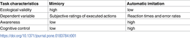
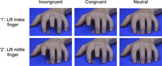
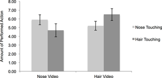

# Homework 5

## Assignment 1

Fork Haomin's repo and provide view as a markdown file and submitted a pull request to merge repo.

## Assignment 2

----

Collaboration:

For Assignment 2 I worked with Wenjie Zhang and Haomin Yang, I found the papers for path analysis. 
Wenjie found the paper for ???, and Haomin Yang(hy1528) will work on Logistic Regression

| **Statistical Analyses**	|  **IV(s)**  |  **IV type(s)** |  **DV(s)**  |  **DV type(s)**  |  **Control Var** | **Control Var type**  | **Question to be answered** | **_H0_** | **alpha** | **link to paper**| 
|:----------:|:----------|:------------|:-------------|:-------------|:------------|:------------- |:------------------|:----:|:-------:|:-------|

ANOVA	| 1, Weight 2, Height 3, Relative Age 4, Shooting 5, Sprint(20m) 6, Agility 7, Dribbling 8, Ball Control  | quantitative | 1, Speed Ability Rating 2, Technical Ability Rating| quantitative | N/A | N/A | 	Are the 8 independent variables(factors) listed above significant enough to demonstrate adequate speed ability and technical ability ratings that ultimately indicate player's adult performance level (APL) | Factors not statistically significant to determine APL | 0.05 | [The influence of speed abilities and technical skills in early adolescence on adult success in soccer: A long-term prospective analysis using ANOVA and SEM approaches](https://journals.plos.org/plosone/article?id=10.1371/journal.pone.0182211) |
|:----------:|:----------|:------------|:-------------|:-------------|:------------|:------------- |:------------------|:----:|:-------:|:-------|
Correlation	|1. 3 Baseline HbA1c(%); 2. Hair Video(participants observe a video of a model who engages in two classes of different behaviors(e.g., nose touching vs. hair touching))|Categorical|Amount of Performed Action|Numerical|1. Amount of friends 2. Learning style 3. Regulatory focus|Categorical|Are mimicry and automatic imitation are correlated| Mimicry and automatic imitation are not positively correlated|0.05|[Mimicry and automatic immitation are not correlated] (https://journals.plos.org/plosone/article?id=10.1371/journal.pone.0183784)|
Logistic Regression	|1. Nose Video, 2. Age(years); 3.Fractional disease duration.|Continuous|the coutcome of glycaemic control, satisfactory or unsatisfactory|Categorical|N/A|N/A|What factors could significantly influence the achievement of satisfactory glycaemic| H0: baseline HbA1c(%) & Age (years) & Fractional disease duration could lower thatn or have no effect on the probability of achieving satisfactory glymaemic|0.05|[Mimicry and automatic immitation are not correlated (https://journals.plos.org/ploseone/article/id=10.1371/journal.pone.0182181&type)|
 |:----------:|:----------|:------------|:-------------|:-------------|:------------|:------------- |:------------------|:----:|:-------:|:-------|
  
 
 

## Assignment 3
Completed the notebook to run chi-square test. I work by my own

## Assignment 4

Run KS, Pearson's and Spearman's test. I work by my own