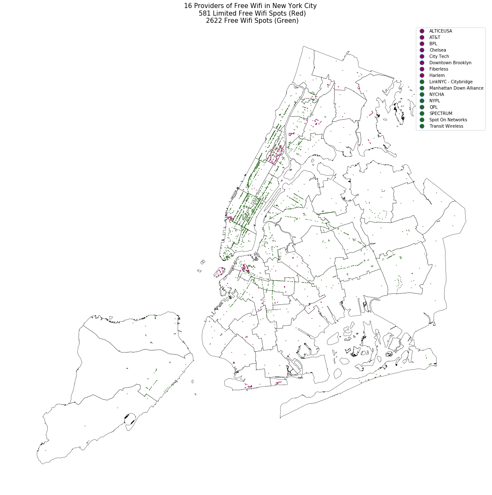
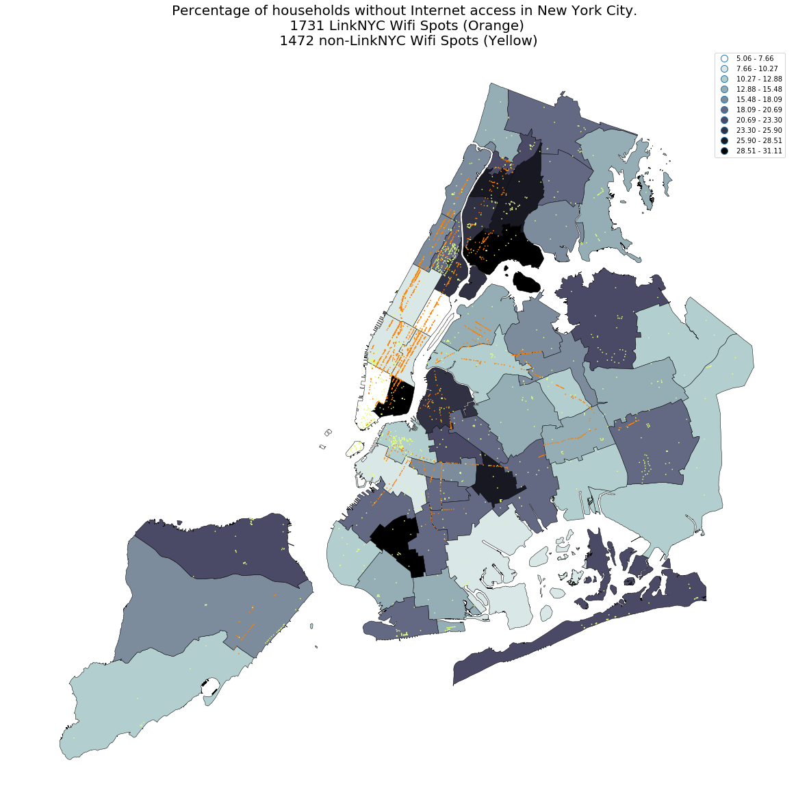

# Homework 8

----
### Assignment 1

** Figure1 ** This Figure identify 17 different Wifi Providers in New York City, which provide either free wifi or limited free wifi. Apart from the LinkNYC. we are see free wifi provide by public library, nyc transift wifi and another private sectors

** Figure2 ** This Figure show the locations comparsion between LinkNYC spots to Non-LinkNYC spots on top with the percentage of household with no internet access (form the 2016 ACS 1yr data) I believe for some neighborhoods, the internet is becoming less afforable and free wifi could be an promising way to ease the problem.

### Assignment 2

Authorea Article link:
